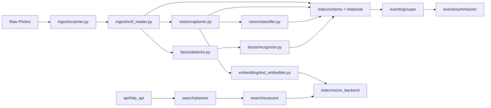

# Architecture

This system is modular, agent-friendly, and local-first.

## Component Graph

## Core Data Models

All in core/models.py:
- PhotoFile
- ExifData
- VisionDescription
- Classification
- FaceDetection
- FaceIdentity
- TextEmbedding
- PhotoRecord
- MemoryEvent

## Storage

Primary:
- Postgres
- pgvector extension

Optional:
- Qdrant HTTP service

All access is abstracted behind index/vector_backend.py
